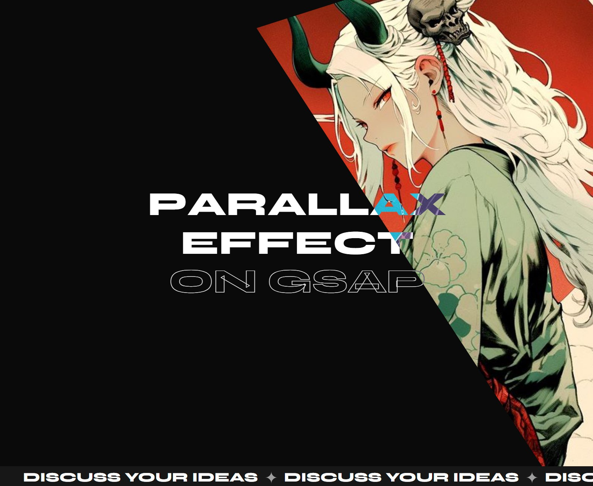
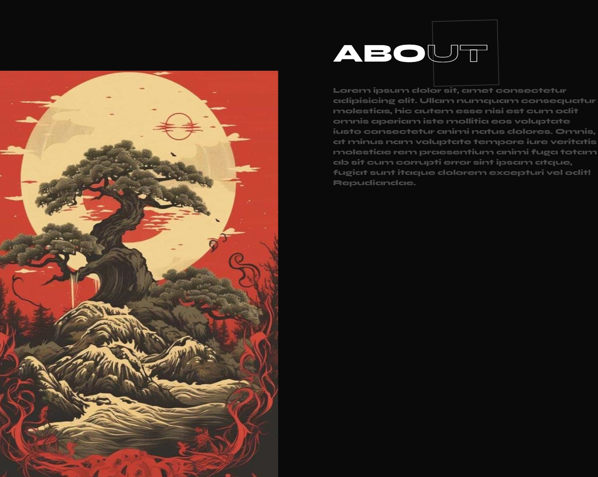
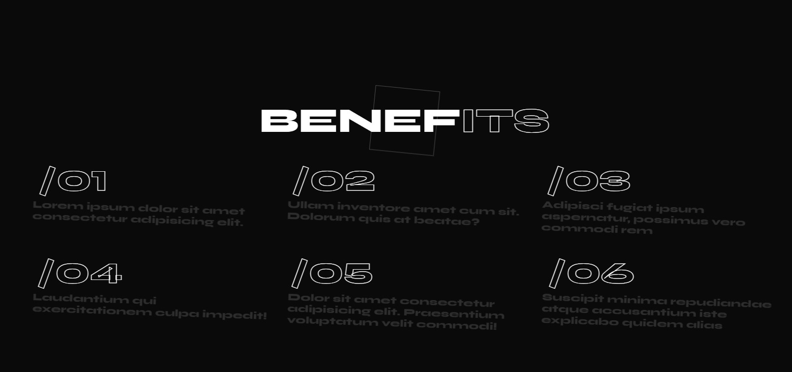
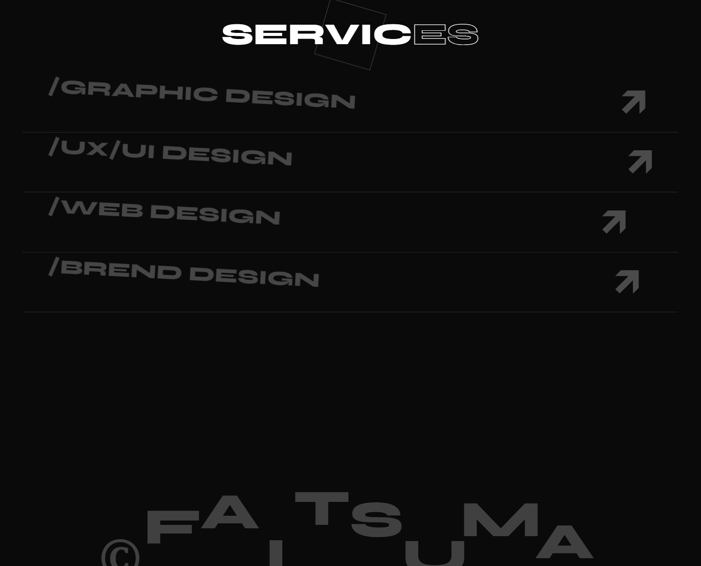

# **_Parallax scrolling effect website using GSAP animation_**

## About

Unique site w/ GSAP scrolling reveal special animation effects!
​
> version: Mar—Apr 2024, created by Gleb 'Faitsuma' Kiryakov

## Preshow

    
   
    
   
    
   
    
   
    
   
    
   

## Documentation

* GSAP animation: https://gsap.com/docs/v3/GSAP;
* Splitting plugin: https://splitting.js.org/guide.html#what-is-splitting;
* Luxy plugin: https://min30327.github.io/luxy.js/;
* GSAP ScrollTrigger plugin: https://gsap.com/docs/v3/Plugins/ScrollTrigger/;

* JavaScript: https://developer.mozilla.org/en-US/docs/Web/JavaScript;
* HTML: https://developer.mozilla.org/en-US/docs/Web/HTML;
* CSS: https://developer.mozilla.org/en-US/docs/Web/CSS;
* SASS: https://sass-lang.com/documentation/;
* SASS compile hero pro extension: https://marketplace.visualstudio.com/items?itemName=Wscats.eno;

* Git: https://githowto.com/ru;
* Google Fonts: https://fonts.google.com;
* Color Picker: https://www.w3schools.com/colors/colors_picker.asp;